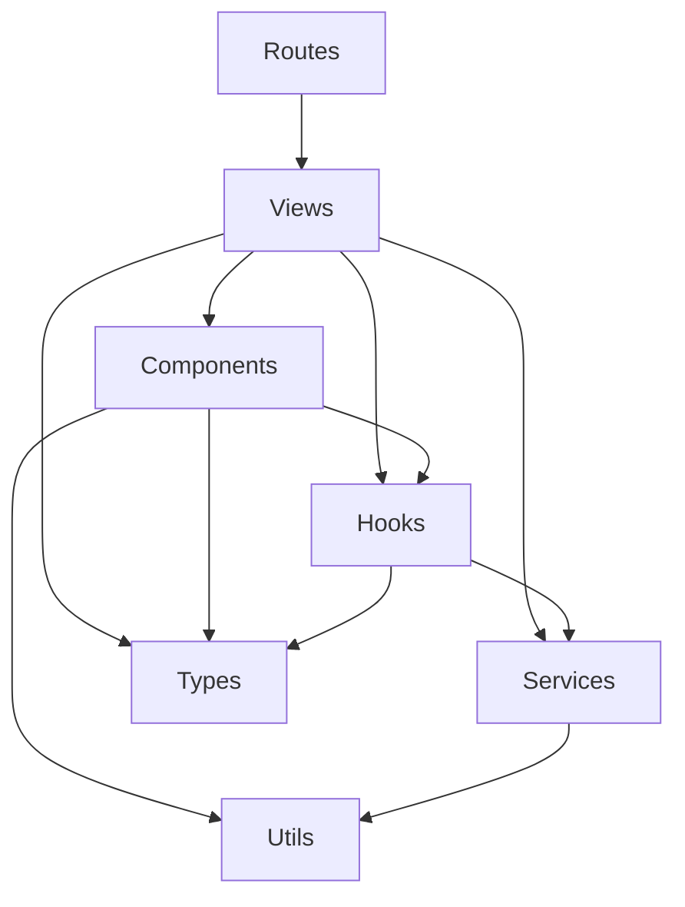

# Architecture Principles

This project follows a **Feature-Based Architecture** with shared layers. Views own their state, hooks, and sub-components, while shared code lives in top-level folders.

## Layer Dependency Rules



| Rule                                | Description                                                                                |
| ----------------------------------- | ------------------------------------------------------------------------------------------ |
| Views import from everything        | Views are the top-level containers; they can use components, services, hooks, types, utils |
| Components do NOT import views      | Shared components must remain view-agnostic                                                |
| Services do NOT import React code   | Services are pure data-access layers; no hooks, no components                              |
| Hooks can import services and types | Hooks encapsulate logic that may call services                                             |
| Types are leaf nodes                | Type files do not import from other layers (except `@getvaas/trustee-commons`)             |

## Shared vs Feature-Scoped Code

- **Shared code** (`src/components/`, `src/hooks/`, `src/services/`, `src/types/`, `src/utils/`): Reusable across multiple views.
- **Feature-scoped code** (`src/views/[ViewName]/hooks/`, `src/views/[ViewName]/components/`, `src/views/[ViewName]/services/`): Owned by a single view and not imported outside of it.

### When to scope vs share

- If a hook, component, or service is used by **only one view**, keep it inside that view's folder.
- If it is used by **two or more views**, promote it to the shared folder.
- **Before creating a new shared or scope resource**, check whether a similar hook, component, or service already exists scoped inside a view. If it does, extract and promote it to the shared layer instead of writing a duplicate from scratch. The goal is to reuse what already works, not reinvent it.

## Provider Hierarchy

Providers are composed in `main.tsx` in this order:

```
QueryClientProvider
  └── AuthProvider (Keycloak)
       └── ThemeProvider (viplay-ui)
            └── TooltipProvider
                 └── RouterProvider
                      └── App (with Suspense + Loader fallback)
```

## Authentication & Role-Based Access

- `PrivateRoute` guards all routes via Keycloak authentication.
- `RoleBasedRoutes` splits into user routes (`userRoutes.tsx`) and admin routes (`boRoutes.tsx`) based on `hasClientRole('bo')`.

## State Management Strategy

| State type                       | Tool                 | Location                      |
| -------------------------------- | -------------------- | ----------------------------- |
| Server/async data                | TanStack React Query | Hooks (useQuery/useMutation)  |
| UI state (page, filters, modals) | useState             | View hooks                    |
| Complex local state              | useReducer           | View-specific reducers        |
| Auth state                       | React Context        | AuthProvider                  |
| Persisted upload state           | localStorage         | `utils/uploadStateStorage.ts` |
